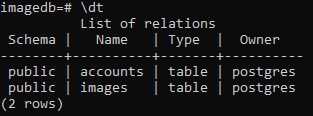
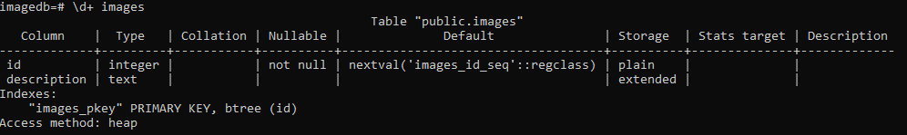
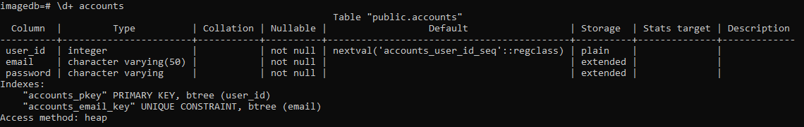

## Project summary    
Template for future projects. Includes react page that communicates with the database through the backend. To view and add content to the database you have to be logged in. You can log in, log out and register a new user. Supports multiple user logins, for example, from two different browsers.
The database is not included. Will need to create it manually beforehand.

Front-end: **ReactJS**    
Back-end: **Flask**    
Database: **PostgreSQL**    
Authentication: **JWT Token based**    

## Python env    
Requirements file is in the backend folder. To install requirements run ```pip install -r requirements.txt```.

## Database structure description that is used in this project   
### Tables   
Database consists of two tables where in one of them we keep the information about accounts and in another we keep information about objects in the database. Both tables have primary key created with serial.   
   
 
### Images  
Table name can be confusing because the table does not consist of images. In the table there is a single column where we just keep description of the object.  
     

### Accounts   
In this table we keep all the registered accounts.   
   

         
Author: Karl Taal
